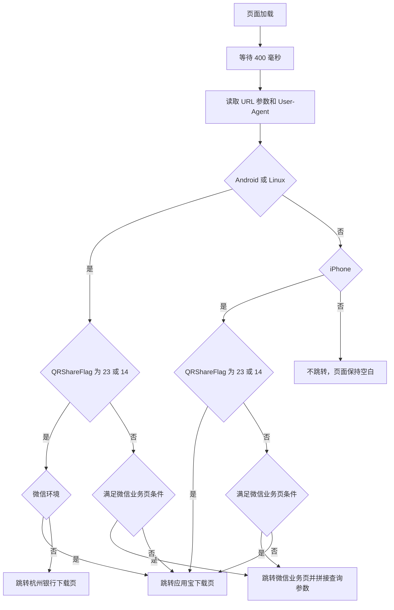

# `wallet.html` 原页面跳转逻辑

本文整理 `wallet.html` 加入鸿蒙判断和其他平台兜底逻辑之前的页面跳转规则。

## 1. 执行入口

页面脚本加载后立即设置一个 400 毫秒的定时器，定时调用 `initWap()`：

```javascript
var initial = function() {
    setTimeout("initWap()", 400);
}();
```

`initWap()` 依次完成以下操作：

1. 从 URL 中读取 `QRShareFlag`。
2. 根据 User-Agent 判断 Android 或 iPhone。
3. 判断页面是否运行在微信内置浏览器中。
4. 根据平台、微信环境及 URL 参数执行页面跳转。

## 2. 平台判断

原页面只识别 Android 和 iPhone：

```javascript
return {
    android: u.indexOf('Android') > -1 || u.indexOf('Linux') > -1,
    iPhone: u.indexOf('iPhone') > -1
};
```

| 平台 | 判断条件 |
| --- | --- |
| Android | User-Agent 包含 `Android` 或 `Linux` |
| iPhone | User-Agent 包含 `iPhone` |
| 其他平台 | 没有对应判断和跳转分支 |

原逻辑先判断 Android，再判断 iPhone。因为 Android 条件同时匹配 `Linux`，部分包含
`Linux` 特征的设备也会进入 Android 分支。

## 3. 公共参数和地址

### 3.1 URL 参数

| 参数或标记 | 用途 |
| --- | --- |
| `QRShareFlag` | 区分二维码分享业务类型 |
| `QRShareFlag=23` | 退税贷业务 |
| `QRShareFlag=14` | 结构性存款业务 |
| `HZBank` | 判断是否满足微信业务页面跳转条件 |
| `isLogin` | 判断是否满足微信业务页面跳转条件 |
| `QRShareFlagZZ != "08"` | 排除 `QRShareFlag=08` 的微信业务跳转 |

### 3.2 跳转地址

| 名称 | 地址 | 用途 |
| --- | --- | --- |
| 应用宝下载页 | `http://a.app.qq.com/o/simple.jsp?pkgname=cn.com.hzb.mobilebank.per` | 默认应用下载入口 |
| 杭州银行下载页 | `http://www.hzbank.com.cn/mobile/walletDownload.html` | Android 特殊业务在非微信环境中的下载入口 |
| 微信业务页 | `https://weixin.hzbank.com.cn/WechatBank/views/wechatfinance/belink.html` | 满足条件时继续处理微信业务，原查询参数会被完整拼接到地址后面 |

## 4. Android 跳转规则

Android 分支首先处理退税贷和结构性存款，再处理其他场景。

| 优先级 | 条件 | 跳转结果 |
| --- | --- | --- |
| 1 | `QRShareFlag` 为 `23` 或 `14`，并且在微信中打开 | 跳转应用宝下载页 |
| 2 | `QRShareFlag` 为 `23` 或 `14`，并且不在微信中打开 | 跳转杭州银行下载页 |
| 3 | 微信环境，URL 同时包含 `QRShareFlag`、`HZBank`、`isLogin`，并且 `QRShareFlag` 不是 `08` | 跳转微信业务页，并拼接原查询参数 |
| 4 | 微信环境，URL 包含 `QRShareFlag`，但不满足上一条件 | 跳转应用宝下载页 |
| 5 | 其他 Android 场景 | 跳转应用宝下载页 |

前两个特殊业务条件完成跳转后会立即 `return`，不会继续执行后续判断。

## 5. iPhone 跳转规则

| 优先级 | 条件 | 跳转结果 |
| --- | --- | --- |
| 1 | `QRShareFlag` 为 `23` 或 `14` | 跳转应用宝下载页 |
| 2 | 微信环境，URL 同时包含 `QRShareFlag`、`HZBank`、`isLogin`，并且 `QRShareFlag` 不是 `08` | 跳转微信业务页，并拼接原查询参数 |
| 3 | 其他 iPhone 场景 | 跳转应用宝下载页 |

iPhone 的退税贷和结构性存款逻辑不区分是否在微信环境中，均跳转应用宝下载页。

## 6. 其他平台行为

原平台分支结构如下：

```javascript
if (Terminal.platform.android) {
    // Android 跳转逻辑
} else if (Terminal.platform.iPhone) {
    // iPhone 跳转逻辑
}
```

最外层没有 `else` 保底逻辑。因此，当 User-Agent 既不匹配 Android，也不匹配 iPhone 时，
`initWap()` 执行结束，页面保持空白，不会发生任何跳转。

## 7. 原逻辑流程图



## 8. 原逻辑边界

- 没有单独识别 HarmonyOS 或 OpenHarmony。
- 兼容 Android、且 User-Agent 包含 `Android` 或 `Linux` 的鸿蒙设备会按 Android 处理。
- 不带 Android 或 Linux 特征的纯血鸿蒙设备无法命中 Android 分支。
- 未识别平台没有默认下载地址，也没有错误提示。
